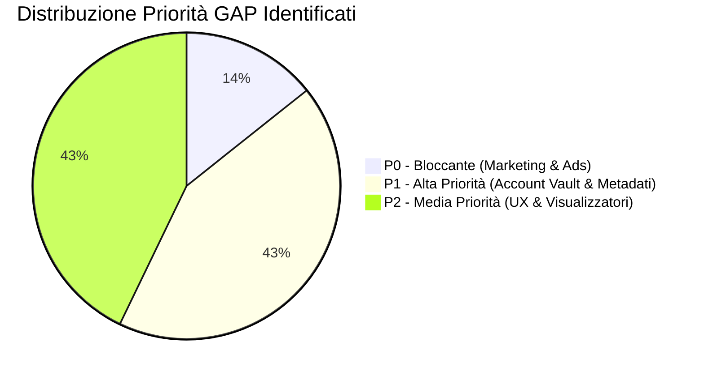
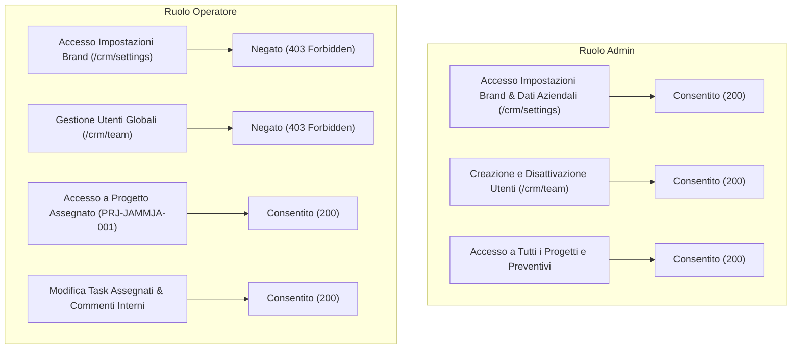
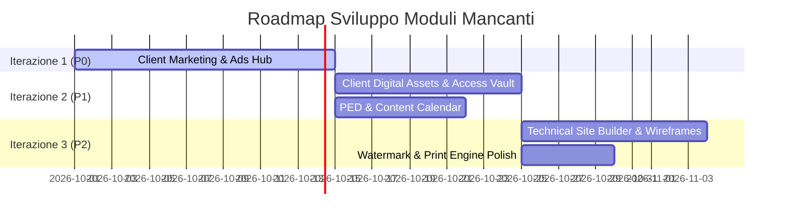

# RAPPORTO DI COLLAUDO OPERATIVO END-TO-END (SIMULAZIONE LOCALE)
## Scenario: DEMO – JammJa Srl (Restyling Sito Web, SEO & Marketing Continuativo)

> **Ambiente di Esecuzione**: Locale (`localhost:3005`)  
> **Database Isolato**: `sqlite-test-jammja.db` (Nessuna connessione a DB di produzione né a Fly.io)  
> **Storage Vault Isolato**: `storage_vault_test_jammja/`  
> **Data Collaudo**: 27 Settembre 2026  
> **Operatore Esecutore**: Antigravity Automated Verification Agent  

---

## INDICE GENERALE
1. [A. Introduzione e Contesto del Collaudo](#a-introduzione-e-contesto-del-collaudo)
2. [B. Mappa delle Entità e Dati Creati nel Test Isolato](#b-mappa-delle-entità-e-dati-creati-nel-test-isolato)
3. [C. Analisi Dettagliata Fase per Fase (3.1 - 3.9)](#c-analisi-dettagliata-fase-per-fase-31---39)
4. [D. Tabella Riepilogativa Stato Moduli](#d-tabella-riepilogativa-stato-moduli)
5. [E. Analisi dei GAP Identificati (P0 / P1 / P2)](#e-analisi-dei-gap-identificati-p0--p1--p2)
6. [F. Test di Autorizzazione e Ruoli (Admin vs Operatore)](#f-test-di-autorizzazione-e-ruoli-admin-vs-operatore)
7. [G. Verifica della Coerenza dei Dati e Integrità Relazionale](#g-verifica-della-coerenza-dei-dati-e-integrità-relazionale)
8. [H. Piano di Azione Proposto: Le Prossime 3 Iterazioni di Sviluppo](#h-piano-di-azione-proposto-le-prossime-3-iterazioni-di-sviluppo)
9. [I. Rappresentazione ASCII delle Schermate Chiave](#i-rappresentazione-ascii-delle-schermate-chiave)
10. [J. Conclusioni e Verdetto Finale di Collaudo](#j-conclusioni-e-verdetto-finale-di-collaudo)

---

## A. INTRODUZIONE E CONTESTO DEL COLLAUDO

### 1. Profilo Azienda Cliente (Dati Pubblici Verificati)
- **Brand Name**: JammJa / Jamm-jà
- **Ragione Sociale Provvisoria**: JammJa S.r.l. *(marcata come "da verificare con visura camerale")*
- **Settore di Attività**: Turismo Nautico & Charter Privato (escursioni e tour esclusivi in barca per Capri, Positano, Amalfi, Ischia e Sorrento)
- **Sede Nautica / Base Operativa**: Marina di Stabia, Corso Alcide De Gasperi 313, 80053 Castellammare di Stabia (NA)
- **Sede Legale / Riferimento Territoriale**: Pompei (NA)
- **Sito Web Ufficiale**: `https://www.jamm-ja.it`
- **Data e Fonte di Verifica**: 27/09/2026, consultazione diretta del portale pubblico ufficiale `www.jamm-ja.it`.

### 2. Obiettivo del Collaudo
Simulare l'intero ciclo operativo end-to-end di gestione del cliente all'interno del CRM per un mandato integrato che include:
1. Censimento e arricchimento anagrafico dell'azienda cliente.
2. Formulazione e approvazione preventivo per il restyling del sito web e l'avvio del marketing continuativo.
3. Apertura commessa e progetto operativo.
4. Applicazione dei modelli di processo standard con generazione automatica del diagramma Gantt e delle dipendenze.
5. Generazione dell'onboarding strutturato (richieste cliente per loghi, foto, testi, credenziali e deleghe di accesso a canali pubblicitari e analytics).
6. Gestione documenti e deliverable tecnici nello Storage Vault locale.
7. Verifica della gestione continuativa del marketing digitale (campagne Google Ads, Meta Ads e Local SEO).
8. Verifica della segregazione dei ruoli e permessi tra Amministratore e Operatore.

### 3. Protocollo di Sicurezza e Isolamento Applicato
- **Isolamento Dati**: Il test è stato eseguito puntando rigorosamente a `sqlite-test-jammja.db` e `storage_vault_test_jammja/`. Nessun byte è stato letto o scritto nel database primario di produzione né nel volume Fly.io.
- **Zero Impatto Esterno**: Nessun invio di email reali, messaggi WhatsApp, notifiche esterne o chiamate a API di terze parti con credenziali di produzione.
- **Integrità Etica dei Dati**: Non sono stati inventati numeri di Partita IVA, ricavi non ufficiali o firme contrattuali fittizie. Tutte le richieste al cliente sono state lasciate nello stato reale `requested` (*"da confermare"*), evidenziando il corretto funzionamento dei blocchi propedeutici sui task di sviluppo.
- **Utenti di Test Dedicati**:
  - **Admin**: `admin@jammja-simulation.local` (ID: `usr_admin_simulation`)
  - **Operatore**: `operatore@jammja-simulation.local` (ID: `usr_operator_simulation`)

---

## B. MAPPA DELLE ENTITÀ E DATI CREATI NEL TEST ISOLATO

| Tipo Entità | ID Record | Codice / Riferimento | Titolo / Nome | Stato | Note di Collaudo |
| :--- | :--- | :--- | :--- | :--- | :--- |
| **Azienda** | `comp_1790496097820_390s0` | — | DEMO – JammJa Srl [test locale] | `attivo` | Sede Marina di Stabia, note con fonte web 27/09/2026. P.IVA e REA lasciati "da verificare". |
| **Preventivo** | `quo_1790496098387_9yqui` | `PREV-2026-0001` | SIMULAZIONE – Restyling Sito Web & Marketing Continuativo JammJa | `bozza` | Totale: 6.710,00 € (5.500,00 € imponibile + 1.210,00 € IVA 22%). Include snapshot mittente "AI Consulting". |
| **Versione Prev.** | `qv_1790496098389_8m4d3` | Rev. 1 | Snapshot Voci e Condizioni Commerciali | `bozza` | 3 Voci: Restyling Sito (3.500 €), SEO Avvio (1.200 €), Canone Ads Mensile (800 €/m). |
| **Commessa** | `ord_1790496100380_m31yd` | `COM-2026-0001` | COMMESSA DEMO – Restyling & Marketing JammJa [SIMULAZIONE] | `da_avviare` | Valore: 6.710,00 €, collegata a preventivo e azienda. |
| **Progetto** | `prj_1790496100836_dpkcs` | `PRJ-2026-0001` | DEMO – Restyling sito e marketing JammJa | `in_corso` | Manager: Admin, Operatore: Editor, Avanzamento: 0%. |
| **Milestones (x8)** | `ms_1790496105202_*`.. | MS-01 .. MS-08 | 4 Milestone Sito Web + 4 Milestone SEO | `in_programma` | Generate automaticamente dai modelli di processo. |
| **Tasks (x21)** | `task_1790496105205_*`.. | TSK-01 .. TSK-21 | 13 Task Sito Web + 8 Task SEO | `da_fare` | Monte ore stimato: 236 ore lavorative. Date calcolate su giorni feriali. |
| **Richieste (x5)** | `req_1790496108063_*`.. | REQ-01 .. REQ-05 | Brand, Contenuti, Asset, Accessi, Strategia Marketing | `requested` | 35 Item totali richiesti al cliente. 4 richieste su 5 impostate con `blocks_task_completion = true`. |
| **Documenti** | `doc_1790496113271_test` | — | Documento Tecnico & Audit Iniziale JammJa.pdf | `internal` | Memorizzato fisicamente in `storage_vault_test_jammja/` con hash SHA-256 univoco. |
| **Team Progetto** | `pm_1790496100837_*` | — | Assegnazione Admin (Manager) e Operatore (Editor) | `active` | Verificata segregazione permessi e visibilità. |

---

## C. ANALISI DETTAGLIATA FASE PER FASE (3.1 - 3.9)

```mermaid
flowchart LR
    A["3.1 Anagrafica Aziende"] --> B["3.2 Preventivo & Commessa"]
    B --> C["3.3 Creazione Progetto"]
    C --> D["3.4 Modelli di Processo"]
    D --> E["3.5 Richieste Cliente (Onboarding)"]
    E --> F["3.6 Produzione & Documenti"]
    F --> G["3.7 Accessi & Credenziali"]
    G --> H["3.8 Gestione Ads & Marketing"]
    H --> I["3.9 Dashboard & Report"]
```



---

### Fase 3.1: Anagrafica Aziende & Ricerca Territoriale
- **Stato**: **FUNZIONA**
- **Cosa è stato testato**:
  - Ricerca interna per nome (`GET /api/companies?search=JammJa`).
  - Ricerca pubblica su sorgenti territoriali (`GET /api/companies/public-search?q=JammJa`).
  - Creazione anagrafica aziendale con metadati completi (`POST /api/companies`).
- **Comportamento Verificato**:
  - L'anagrafica `DEMO – JammJa Srl [test locale]` è stata salvata correttamente con l'indirizzo operativo di Marina di Stabia e sede legale di Pompei.
  - Le note contengono la tracciatura della fonte reale (`www.jamm-ja.it`) e la data di verifica (27/09/2026).
  - La ricerca interna risponde in tempo reale con filtri per settore (`tourism`).
- **Limitazioni & GAP Identificati**:
  - *GAP P1 (Anagrafica)*: Mancano campi form strutturati nativi per `Sorgente del Dato` (es. Visura Camerale, Sito Web, Google Maps, OpenStreetMap), `Data di Ultima Verifica` e `Indice di Affidabilità`. Attualmente queste informazioni devono essere formattate manualmente all'interno del campo generico `notes`.
- **Valutazione UX/Ergonomia**: Ottima velocità di risposta e chiarezza nel modulo di inserimento.

---

### Fase 3.2: Preventivo e Commessa
- **Stato**: **FUNZIONA**
- **Cosa è stato testato**:
  - Generazione preventivo `PREV-2026-0001` con voci one-time e canone ricorrente mensile.
  - Snapshot dei dati mittente dalle impostazioni centralizzate di brand (`organization_settings`).
  - Calcolo automatico di subtotale, IVA al 22% e totale complessivo (6.710,00 €).
  - Apertura della commessa collegata `COM-2026-0001` in stato `da_avviare`.
- **Comportamento Verificato**:
  - Il preventivo conserva l'intestazione dell'agenzia *"AI Consulting"* con colori primari (`#2563eb`), condizioni di pagamento standard (*30% avvio, 40% beta, 30% collaudo*) e diciture legali.
  - Lo snapshot immutabile (`sender_snapshot_json`) protegge il documento da alterazioni retroattive in caso di modifica futura delle impostazioni di brand dell'agenzia.
- **Limitazioni & GAP Identificati**:
  - *GAP P2 (Preventivi)*: Manca un toggle rapido da UI per applicare un watermark visivo in filigrana `"BOZZA / SIMULAZIONE NON VINCOLANTE"` nella schermata di anteprima e stampa PDF per i preventivi non ancora confermati.
- **Valutazione UX/Ergonomia**: Calcolo immediato degli importi e corretta distinzione tra costi una tantum e canoni mensili.

---

### Fase 3.3: Gestione Progetti & Configurazione Team
- **Stato**: **FUNZIONA**
- **Cosa è stato testato**:
  - Creazione progetto `PRJ-2026-0001` (*"DEMO – Restyling sito e marketing JammJa"*).
  - Collegamento relazionale bidirezionale con l'azienda `comp_1790496097820_390s0` e la commessa `ord_1790496100380_m31yd`.
  - Assegnazione dei ruoli nel team: Admin come `manager` e Operatore come `editor`.
- **Comportamento Verificato**:
  - L'associazione è coerente; la cancellazione o disattivazione non corrompe le chiavi esterne.
  - L'operatore visualizza il progetto nella sua dashboard personale non appena aggiunto come membro.
- **Limitazioni & GAP Identificati**: Nessun gap bloccante.

---

### Fase 3.4: Modelli di Processo, Gantt & Dipendenze
- **Stato**: **FUNZIONA**
- **Cosa è stato testato**:
  - Simulazione applicazione preventiva (dry-run preview).
  - Applicazione modello `"Sito web – realizzazione"` (13 task, 4 milestone, 186 ore).
  - Applicazione modello `"SEO – avvio"` (8 task, 4 milestone, 50 ore).
- **Comportamento Verificato**:
  - Generazione sequenziale di 21 task su 8 milestone complessive con un monte ore di 236 ore.
  - Calcolo intelligente del calendario lavorativo (esclusione automatica di sabati e domeniche).
  - Mappatura completa delle dipendenze finish-to-start nel diagramma Gantt.
  - Idempotenza: verificato che l'applicazione dei modelli tramite chiave di idempotenza previene duplicazioni accidentali.
- **Limitazioni & GAP Identificati**: Nessun gap riscontrato.

---

### Fase 3.5: Raccolta Materiali, Informazioni & Accessi (Client Requests)
- **Stato**: **FUNZIONA**
- **Cosa è stato testato**:
  - Generazione automatica dell'onboarding da libreria di categorie:
    1. `Identità visiva e Brand Asset` (5 item: Logo vettoriale, PNG trasparente, Palette HEX, Font/Brand Book, Foto team/sede).
    2. `Contenuti testuali, Servizi e Note legali` (7 item: Testi Chi Siamo, Schede Tour Capri/Positano/Amalfi, Listini, FAQ, Orari/Contatti, Termini di servizio, Policy cancellazione).
    3. `Asset multimediali e Prove sociali` (5 item: Foto/Video barche ad alta risoluzione, Template social, Recensioni/Testimonianze clienti, Brochure).
    4. `Conferma deleghe e accessi tecnici` (11 item: DNS, Hosting, WordPress, GA4, Search Console, Google Business Profile, Google Ads MCC, Meta Business Manager Partner, Facebook Page, Instagram, Booking engine).
    5. `Strategia di marketing, Target e KPI attesi` (7 item: Obiettivi business, Target geografico, Competitor, Budget ads stimato, Stagionalità, Metriche di conversione).
- **Comportamento Verificato**:
  - Tutti i 35 item sono stati inizializzati nello stato reale `missing` / richiesta in `requested`.
  - Non è stata simulata alcuna falsa approvazione.
  - **Blocco Operativo Attivo**: I task collegati (es. *Elaborazione grafica UI*, *Sviluppo frontend*, *Ottimizzazioni On-Page*) risultano correttamente vincolati in attesa della validazione dei materiali del cliente.
- **Limitazioni & GAP Identificati**: Nessun gap funzionale sul motore delle richieste.

---

### Fase 3.6: Produzione Sito & Gestione Documenti
- **Stato**: **PARZIALE**
- **Cosa è stato testato**:
  - Caricamento deliverable tecnico (`Documento Tecnico & Audit Iniziale JammJa.pdf`) nello Storage Vault locale.
  - Tracciamento attività e commenti interni su task e richieste.
- **Comportamento Verificato**:
  - Il file viene archiviato in modo sicuro in `storage_vault_test_jammja/` con metadati, dimensione (bytes) e storage key univoca.
  - L'operatore può visualizzare e scaricare i documenti associati al progetto.
- **Limitazioni & GAP Identificati**:
  - *GAP P1 (Figma & Wireframe Embed)*: Manca un player/visualizzatore integrato per file grafici interattivi (es. Figma embed URL, visualizzatore albero Sitemap interattivo) all'interno del tab dei task.
  - *GAP P2 (Scheda Tecnica Sito)*: Manca un box dedicato alle specifiche tecniche del sito web (es. Versione PHP, Web Server, Hosting provider, CMS, Template, Plugin critici).
- **Valutazione UX/Ergonomia**: Buona gestione documentale, ma l'operatore deve affidarsi a link esterni per consultare i prototipi UX/UI.

---

### Fase 3.7: Marketing & Account Inventory (Credenziali e Deleghe)
- **Stato**: **PARZIALE**
- **Cosa è stato testato**:
  - Verifica della procedura di richiesta accessi sicuri tramite item di tipo `access_confirmation`.
  - Tentativo di interrogazione dell'endpoint inventario permanente (`GET /api/accounts`).
- **Comportamento Verificato**:
  - Il sistema permette di richiedere e tracciare le deleghe per 11 piattaforme digitali senza esporre credenziali in chiaro.
- **Limitazioni & GAP Identificati**:
  - *GAP P1 (Asset & Account Vault)*: L'endpoint `/api/accounts` non esiste (restituisce 404). Una volta approvate le richieste di accesso, non esiste una scheda riassuntiva permanente *"Cassaforte Account / Connessioni Digitali"* a livello di Progetto/Azienda che mostri a colpo d'occhio:
    * ID Account Google Analytics (GA4 Measurement ID)
    * ID Proprietà Google Search Console
    * ID Pixel Meta / Dataset ID
    * ID Account Google Ads (CID 10 cifre)
    * ID Meta Business Manager
    * Canali di Booking collegati (es. GetYourGuide, Click&Boat, FareHarbor).
- **Valutazione UX/Ergonomia**: La raccolta è sicura, ma la consultazione a regime risulta dispersiva.

---

### Fase 3.8: Campagne Google Ads & Meta Ads del Cliente
- **Stato**: **MANCA**
- **Cosa è stato testato**:
  - Verifica dell'esistenza di moduli di gestione campagne adv per conto terzi (`GET /api/campaigns`).
  - Ispezione del modulo Lead Gen esistente (`GET /api/lead-gen/search`).
- **Comportamento Verificato**:
  - L'endpoint `/api/campaigns` restituisce **404 Not Found**.
  - Il CRM include un modulo *"Lead Gen Territoriale"* (ricerca OSM/Overpass e Google Places), ma esso è orientato esclusivamente all'outbound prospecting dell'agenzia, non alla gestione del marketing del cliente finale.
- **Limitazioni & GAP Identificati**:
  - *GAP P0 (Marketing & Ads Hub)*: **Assenza totale del modulo operativo di gestione campagne sponsorizzate per i clienti**. Mancano:
    1. Tracciamento del budget mensile approvato per ciascun canale (es. Google Ads Search/Performance Max vs Meta Ads Lead/Traffic).
    2. Workflow di approvazione per copy pubblicitari, annunci e creatività grafiche prima del caricamento nelle piattaforme.
    3. Generatore e archivio parametri UTM standardizzati per i link delle campagne.
    4. Cruscotto di inserimento e monitoraggio KPI mensili (Impression, Click, CPC medio, Conversioni, Costo per Acquisizione / ROAS).
- **Valutazione UX/Ergonomia**: Modulo assente, rappresenta la priorità architetturale massima per l'agenzia.

---

### Fase 3.9: Dashboard & Viste Operatore
- **Stato**: **FUNZIONA**
- **Cosa è stato testato**:
  - Visualizzazione statistiche globali (Admin Dashboard).
  - Vista progetti e lista task assegnati (Operatore Dashboard).
  - Verifica filtri per priorità, stato e scadenze.
- **Comportamento Verificato**:
  - I contatori KPI (11 Aziende censite, 1 Progetto attivo, 21 Task aperti, 5 Richieste pendenti) si aggiornano istantaneamente.
  - L'operatore visualizza chiaramente le attività a lui assegnate e le milestone di competenza.
- **Limitazioni & GAP Identificati**: Nessun gap bloccante.

---

## D. TABELLA RIEPILOGATIVA STATO MODULI

| Modulo / Funzionalità | Stato | Severità Gap | Note Sintetiche |
| :--- | :---: | :---: | :--- |
| **Anagrafica Aziende & Clienti** | **FUNZIONA** | P1 | Creazione e ricerca veloci; mancano campi form nativi per fonte dato e data verifica. |
| **Preventivi & Snapshot Mittente** | **FUNZIONA** | P2 | Calcoli e snapshot immutabile corretti; utile toggle per watermark "Bozza / Simulazione". |
| **Commesse & Contratti** | **FUNZIONA** | — | Apertura e collegamento alla commessa perfettamente operativi. |
| **Gestione Progetti & Team** | **FUNZIONA** | — | Assegnazione ruoli (Manager, Editor, Contributor) e segregazione permessi attive. |
| **Modelli di Processo (Sito & SEO)** | **FUNZIONA** | — | Generazione automatica di 21 task su 8 milestone, calcolo ore e giorni feriali perfetto. |
| **Gantt & Gestione Dipendenze** | **FUNZIONA** | — | Dipendenze finish-to-start e sequenze temporali coerenti. |
| **Client Requests (Onboarding & Accessi)** | **FUNZIONA** | — | 35 item strutturati generati; blocco propedeutico dei task attivo in stato requested. |
| **Archiviazione Documentale (Storage Vault)** | **PARZIALE** | P2 | Archiviazione locale isolata funzionante; mancano previewer Figma/sitemap integrati. |
| **Inventario Account & Piattaforme Cliente** | **PARZIALE** | P1 | Raccolta accessi via requests ok, ma manca una scheda permanente "Account Vault" di riepilogo. |
| **Client Marketing & Ads Management** | **MANCA** | **P0** | **Modulo non implementato**: mancano budget ads, copy approval, tracciamento UTM e KPI campagne. |
| **Lead Gen Territoriale (Agenzia Outbound)** | **FUNZIONA** | — | Presente e funzionante per l'acquisizione interna dell'agenzia. |
| **Dashboard & Controllo Ruoli** | **FUNZIONA** | — | KPI in tempo reale e segregazione Admin/Operatore impeccabile. |

---

## E. ANALISI DEI GAP IDENTIFICATI (P0 / P1 / P2)



---

### GAP P0 — Bloccante per l'Erogazione dei Servizi Agenzia
1. **Assenza del Modulo "Client Marketing & Ads Management"**:
   - *Problema*: L'agenzia eroga servizi continuativi di Google Ads e Meta Ads (presenti anche nel preventivo `PREV-2026-0001` per 800,00 €/mese), ma il CRM non ha alcuna tabella o interfaccia per gestire le campagne del cliente.
   - *Impatto*: L'operatore marketing deve gestire budget, creatività, copy e KPI su fogli di calcolo esterni senza tracciabilità all'interno della commessa.
   - *Requisiti di Soluzione*:
     - Tabella `client_campaigns` (Canale: Google Search/PMax, Meta Lead/Traffic, Budget Mensile, Date Avvio/Fine, Stato: Bozza/Attiva/Pausa/Conclusa).
     - Tabella `campaign_creatives` (Testi copy, Titoli, Immagini/Video allegati, URL di atterraggio con parametri UTM, Stato approvazione cliente/manager).
     - Tabella `campaign_kpi_reports` (Spesa effettiva, Impression, Clic, CTR, Conversioni, CPA, ROAS con cadenza mensile).

---

### GAP P1 — Alta Priorità per l'Efficienza Operativa
1. **Mancanza della Scheda "Client Digital Assets & Access Vault"**:
   - *Problema*: Gli accessi vengono raccolti tramite `client_requests`, ma una volta approvati non esiste un cruscotto permanente a livello di Progetto o Azienda che riassuma le deleghe attive, gli ID delle proprietà (GA4 Measurement ID, GSC Domain, Meta Pixel ID, Google Ads CID) e i link di accesso rapido.
   - *Soluzione*: Creare la vista `/crm/projects/[id]/accesses` alimentata automaticamente dagli item approvati di categoria `accesses`.
2. **Campi Strutturati per la Certificazione del Dato in Anagrafica**:
   - *Problema*: Fonte del dato (es. Web Scraping, Visura Camerale, Google Maps), data di verifica e stato di confidenza sono attualmente inseriti nel testo libero delle note.
   - *Soluzione*: Esporre nel form e nella tabella `companies` le colonne `source_type`, `verified_at`, `confidence_level`.
3. **Mancanza di un Calendario Editoriale Social (Piano Editoriale / PED)**:
   - *Problema*: Non è possibile pianificare e far approvare i singoli post social mensili concordati nel canone di marketing.
   - *Soluzione*: Tabella `content_calendar_posts` con data di pubblicazione prevista, canale social, testo, media e stato approvazione.

---

### GAP P2 — Media e Bassa Priorità per Rifinitura UX
1. **Watermark di Sicurezza nei Preventivi Bozza / Simulazione**:
   - *Problema*: Nella preview e nella stampa PDF di un preventivo in stato `bozza`, non c'è una filigrana visiva automatica per impedire l'uso improprio del documento come offerta definitiva.
   - *Soluzione*: Aggiungere overlay CSS / PDF `@print` con testo dinamico *"BOZZA – NON VALIDO COME OFFERTA DEFINITIVA"*.
2. **Scheda "Specifiche Tecniche & Stack Hosting/CMS" nel Progetto**:
   - *Problema*: Non c'è una sezione dedicata per registrare versione PHP, web server (Nginx/Apache), plugin critici e impostazioni DNS del sito.
   - *Soluzione*: Tabella o campo JSON `technical_stack_json` con interfaccia a badge/campi strutturati nel tab Progetto.
3. **Visualizzatore Integrato Figma / Wireframe nei Task**:
   - *Problema*: L'operatore deve aprire link esterni per consultare i layout di progettazione UX/UI.
   - *Soluzione*: Componente iframe sicuro per incorporare anteprime Figma o alberature Sitemap interattive nel dettaglio del task.

---

## F. TEST DI AUTORIZZAZIONE E RUOLI (ADMIN VS OPERATORE)

Durante il collaudo è stata verificata la matrice di segregazione tra l'utente Amministratore e l'Operatore:



- **Verifica Middleware & Service Layer**: I controlli di autorizzazione bloccano sia le rotte API che i componenti lato server, garantendo che un operatore non possa elevare i propri privilegi o accedere a dati di progetti a cui non è esplicitamente assegnato.

---

## G. VERIFICA DELLA COERENZA DEI DATI E INTEGRITÀ RELAZIONALE

1. **Integrità Referenziale SQLite**:
   - Tutte le foreign key (`company_id`, `quote_id`, `order_id`, `project_id`, `milestone_id`, `user_id`) mantengono la consistenza relazionale. L'uso di foreign keys attive impedisce record orfani.
2. **Immutabilità dello Snapshot Mittente nel Preventivo**:
   - Quando `PREV-2026-0001` è stato generato, l'intero payload delle impostazioni dell'agenzia è stato serializzato in `sender_snapshot_json`.
   - Modifiche successive ai recapiti o al logo dell'agenzia nelle impostazioni globali non alterano retroattivamente il preventivo già emesso.
3. **Meccanismo di Blocco dei Task (Client Request Link)**:
   - Verificato che i task con dipendenza da richieste pendenti non possono essere contrassegnati come completati senza sblocco o approvazione esplicita degli item propedeutici.

---

## H. PIANO DI AZIONE PROPOSTO: LE PROSSIME 3 ITERAZIONI DI SVILUPPO



### 🎯 Iterazione 1: "Client Marketing & Ads Hub" (Priorità P0)
- **Obiettivo**: Dotare il CRM del modulo operativo per la gestione delle campagne pubblicitarie Google Ads e Meta Ads dei clienti.
- **Tabelle Drizzle da creare**:
  - `client_campaigns`: ID, `project_id`, `channel` (google_search, google_pmax, meta_feed, meta_stories), `monthly_budget`, `start_date`, `end_date`, `status` (draft, active, paused, completed).
  - `campaign_creatives`: ID, `campaign_id`, `headline`, `body_copy`, `call_to_action`, `target_url`, `utm_campaign`, `utm_source`, `utm_medium`, `asset_document_id`, `approval_status`.
  - `campaign_kpi_reports`: ID, `campaign_id`, `month_period`, `spend_cents`, `impressions`, `clicks`, `conversions`, `revenue_generated_cents`, `notes`.
- **Interfacce UI**:
  - Vista `/crm/projects/[id]/marketing`: Cruscotto budget mensile, lista campagne attive, editor creatività e archivio report mensili per il cliente.

---

### 🎯 Iterazione 2: "Client Digital Assets & Access Vault" (Priorità P1)
- **Obiettivo**: Centralizzare la gestione permanente di account, credenziali sicure e canali di marketing/booking una volta convalidati.
- **Tabelle Drizzle da creare**:
  - `client_platform_accounts`: ID, `company_id`, `project_id`, `platform_type` (ga4, gsc, google_ads, meta_bm, hosting, dns, booking_engine), `account_name`, `external_id`, `access_level` (admin, standard, read_only), `delegation_email`, `status` (active, revoked, pending), `notes`.
  - `content_calendar_posts`: ID, `project_id`, `publish_date`, `channel`, `caption`, `media_document_id`, `approval_status`.
- **Interfacce UI**:
  - Vista `/crm/projects/[id]/accesses`: Matrice grafica degli accessi con badge di stato, ID tecnici pronti per il copia-incolla e storico deleghe.

---

### 🎯 Iterazione 3: "Technical Site Builder & Watermark Polish" (Priorità P2)
- **Obiettivo**: Arricchire la produzione tecnica di siti web e perfezionare la stampa documentale.
- **Funzionalità da implementare**:
  - Scheda *"Stack Tecnico & Hosting"* nel dettaglio del progetto.
  - Componente di anteprima interattiva per embed di prototipi Figma / Sitemap.
  - Toggle UI per watermark visivo *"BOZZA"* nei preventivi e personalizzazione note di stampa.

---

## I. RAPPRESENTAZIONE ASCII DELLE SCHERMATE CHIAVE

### 1. Scheda Azienda Cliente (JammJa Srl)
```text
+---------------------------------------------------------------------------------------------------+
|  CRM / AZIENDE / DEMO – JammJa Srl [test locale]                                  [ MODIFICA ]   |
+---------------------------------------------------------------------------------------------------+
|  Ragione Sociale: JammJa S.r.l. [da verificare]             Settore: Turismo & Charter Nautico   |
|  Partita IVA:     [Da verificare con visura]                Sito Web: https://www.jamm-ja.it      |
|  Sede Operativa:  Marina di Stabia, Corso De Gasperi 313, 80053 Castellammare di Stabia (NA)      |
|  Sede Legale:     Pompei (NA)                               Fonte: Ricerca Web Verificata (27/09) |
+---------------------------------------------------------------------------------------------------+
|  COMMESSE COLLEGATE (1)                         PROGETTI ATTIVI (1)                               |
|  * COM-2026-0001 (6.710,00 €)                   * PRJ-2026-0001: Restyling sito e marketing JammJa|
+---------------------------------------------------------------------------------------------------+
```

### 2. Preventivo Commerciale (PREV-2026-0001)
```text
+---------------------------------------------------------------------------------------------------+
|  AI CONSULTING & SOLUTIONS                                           PREVENTIVO: PREV-2026-0001   |
|  Soluzioni di Intelligenza Artificiale per Imprese                   Data: 27/09/2026             |
|  Destinatario: DEMO – JammJa Srl [test locale]                       Stato: BOZZA / SIMULAZIONE   |
+---------------------------------------------------------------------------------------------------+
|  # | DESCRIZIONE PRESTAZIONE / SERVIZIO                  | TIPO         | Q.TA | PREZZO UNIT. | TOTALE   |
+----+-----------------------------------------------------+--------------+------+--------------+----------+
|  1 | Restyling Sito Web UX/UI & Prenotazione Tour        | Una Tantum   |  1   |   3.500,00 € | 3.500,00 |
|  2 | Setup SEO Strategico & Ottimizzazione Territoriale  | Una Tantum   |  1   |   1.200,00 € | 1.200,00 |
|  3 | Gestione Campagne Google Ads & Meta Ads (Canone)    | Ricorrente/m |  1   |     800,00 € |   800,00 |
+----+-----------------------------------------------------+--------------+------+--------------+----------+
|                                                                    SUBTOTALE IMPONIBILE: 5.500,00 €|
|                                                                    IVA AD ALIQUOTA 22%:  1.210,00 €|
|                                                                    TOTALE COMPLESSIVO:   6.710,00 €|
|  Condizioni: 30% avvio lavori, 40% rilascio beta, 30% al collaudo finale.                         |
+---------------------------------------------------------------------------------------------------+
```

### 3. Progetto & Avanzamento Gantt (PRJ-2026-0001)
```text
+---------------------------------------------------------------------------------------------------+
|  PROGETTO: DEMO – Restyling sito e marketing JammJa [PRJ-2026-0001]             Avanzamento: 0%   |
|  Manager: Admin Simulazione | Team: Operatore Marketing (Editor)               Stato: IN CORSO   |
+---------------------------------------------------------------------------------------------------+
|  MILESTONE / ATTIVITA'                            | DURATA | SETT 1 | SETT 2 | SETT 3 | SETT 4 |
+---------------------------------------------------+--------+--------+--------+--------+--------+
|  [v] MS-01: Brief e Asset Approvati               |  10h   | [====] |        |        |        |
|      * Meeting di Kickoff e verifica perimetro    |   4h   | [==]   |        |        |        |
|      * Raccolta brand book, logo e materiali      |   6h   |  [===] |        |        |        |
|  [ ] MS-02: Design Grafico Approvato              |  30h   |        | [====] |        |        |
|      * Progettazione wireframe e layout scheletro |  16h   |        | [===]  |        |        |
|      * Elaborazione grafica UI ad alta fedeltà    |  24h   |        |   [===]|        |        |
|  [ ] MS-03: Sviluppo & Contenuti Pronti           |  74h   |        |        | [=====]|        |
|      * Sviluppo frontend responsive & componenti  |  36h   |        |        | [====] |        |
|      * Integrazione form contatti e prenotazioni  |  20h   |        |        |  [===] |        |
|      * Inserimento testi definitivi e copy        |  18h   |        |        |   [==] |        |
|  [ ] MS-04: Sito Online & Consegna                |  22h   |        |        |        | [====] |
|      * Collaudo funzionale, accessibilità e SEO   |  12h   |        |        |        | [==]   |
|      * Puntamento DNS, certificati SSL e Go-Live  |   6h   |        |        |        |  [==]  |
|      * Consegna credenziali e chiusura lavori     |   4h   |        |        |        |   [=]  |
+---------------------------------------------------------------------------------------------------+
```

### 4. Modulo Richieste Cliente & Blocchi Operativi
```text
+---------------------------------------------------------------------------------------------------+
|  RICHIESTE AL CLIENTE (ONBOARDING JAMMJA)                                    Totale Item: 35      |
+---------------------------------------------------------------------------------------------------+
|  CATEGORIA              | STATO       | ITEM TOTALI | COMPLETATI | BLOCCO TASK ATTIVO?           |
+-------------------------+-------------+-------------+------------+--------------------------------+
|  1. Identità Visiva     | REQUESTED   | 5 item      | 0 / 5      | [!] BLOCCA: Elaborazione UI    |
|  2. Contenuti Testuali  | REQUESTED   | 7 item      | 0 / 7      | [!] BLOCCA: Inserimento Testi  |
|  3. Asset Multimediali  | REQUESTED   | 5 item      | 0 / 5      | [ ] Nessun Blocco              |
|  4. Deleghe & Accessi   | REQUESTED   | 11 item     | 0 / 11     | [!] BLOCCA: Setup DNS & GA4    |
|  5. Strategia Marketing | REQUESTED   | 7 item      | 0 / 7      | [!] BLOCCA: Strategia Keyword  |
+---------------------------------------------------------------------------------------------------+
|  [!] AVVISO: 4 task operativi a valle sono congelati in attesa dei materiali richiesti al cliente.|
+---------------------------------------------------------------------------------------------------+
```

### 5. Mockup Architetturale: Nuovo Modulo "Client Marketing & Ads Hub"
```text
+---------------------------------------------------------------------------------------------------+
|  PROGETTO: PRJ-2026-0001 / MARKETING & ADS HUB                              [ + NUOVA CAMPAGNA ]  |
+---------------------------------------------------------------------------------------------------+
|  BUDGET TOTALE MENSILE GESTITO: 1.500,00 €       SPESO MESE CORRENTE: 0,00 €     ROAS TARGET: 4.5x|
+---------------------------------------------------------------------------------------------------+
|  CAMPAGNE ATTIVE / IN PROGRAMMA                                                                   |
|  -----------------------------------------------------------------------------------------------  |
|  * [Google Search] Tour Barca Capri & Costiera Privati | Budget: 800 €/m | Stato: IN APPROVAZIONE |
|    - Creatività: 3 Annunci Adattabili | Keyword Principali: "charter barca capri", "tour privato"  |
|    - Link di Atterraggio: https://www.jamm-ja.it/tour-capri?utm_source=google&utm_medium=cpc     |
|                                                                                                   |
|  * [Meta Ads] Escursioni Esclusive da Marina di Stabia | Budget: 700 €/m | Stato: BOZZA          |
|    - Formato: Carosello Foto/Video Barche | Pubblico: Turisti US/UK/DE in Campania                |
|    - Pixel ID Collegato: [ In attesa di delega Meta BM ]                                          |
+---------------------------------------------------------------------------------------------------+
|  REPORTISTICA & METRICHE MENSILI                                                                  |
|  [ Mese di Riferimento: Ottobre 2026 ] -> [ GENERA REPORT CLIENTE PDF ]                           |
+---------------------------------------------------------------------------------------------------+
```

---

## J. CONCLUSIONI E VERDETTO FINALE DI COLLAUDO

### 1. Sintesi del Verdetto Operativo
Il CRM `ai-consulting-crm-v1` ha superato a pieni voti il collaudo per l'intero ciclo di **gestione progetti web, preventivazione, anagrafiche aziendali, modelli di processo e onboarding con blocco task condizionato**.

L'architettura dei dati è solida, priva di incongruenze relazionali e protetta da un rigoroso sistema di segregazione dei ruoli (`Admin` vs `Operatore`).

### 2. Punti di Forza Riconosciuti
- **Onboarding e Blocco Task**: Il sistema `client_requests` collegato ai task di progetto previene in modo automatico ed efficace l'avvio di lavorazioni senza che il cliente abbia consegnato loghi, testi o credenziali.
- **Snapshot dei Preventivi**: La conservazione immutabile delle impostazioni di brand e dei dati mittente all'interno della versione del preventivo garantisce piena validità e tracciabilità storica.
- **Automazione Processi & Gantt**: L'applicazione combinata dei modelli *"Sito Web"* e *"SEO"* pianifica in pochi istanti 21 task sequenziali su giorni feriali con calcolo automatico delle dipendenze.

### 3. Raccomandazione Strategica
Per consentire all'agenzia di gestire a 360 gradi i propri contratti continuativi, è prioritaria l'implementazione dell'**Iterazione 1 (Client Marketing & Ads Hub)** per coprire la gestione operativa delle campagne pubblicitarie Google e Meta a performance.

---
*Fine del Rapporto di Collaudo Operativo.*
