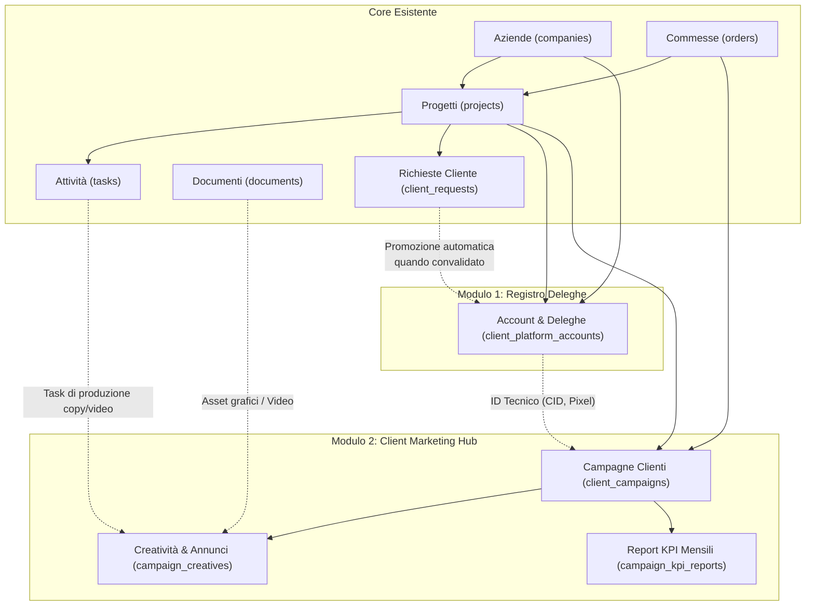
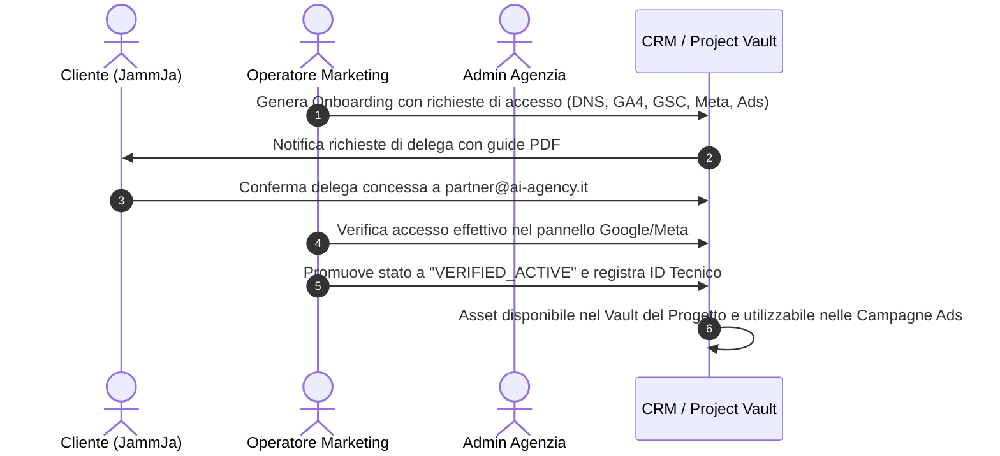
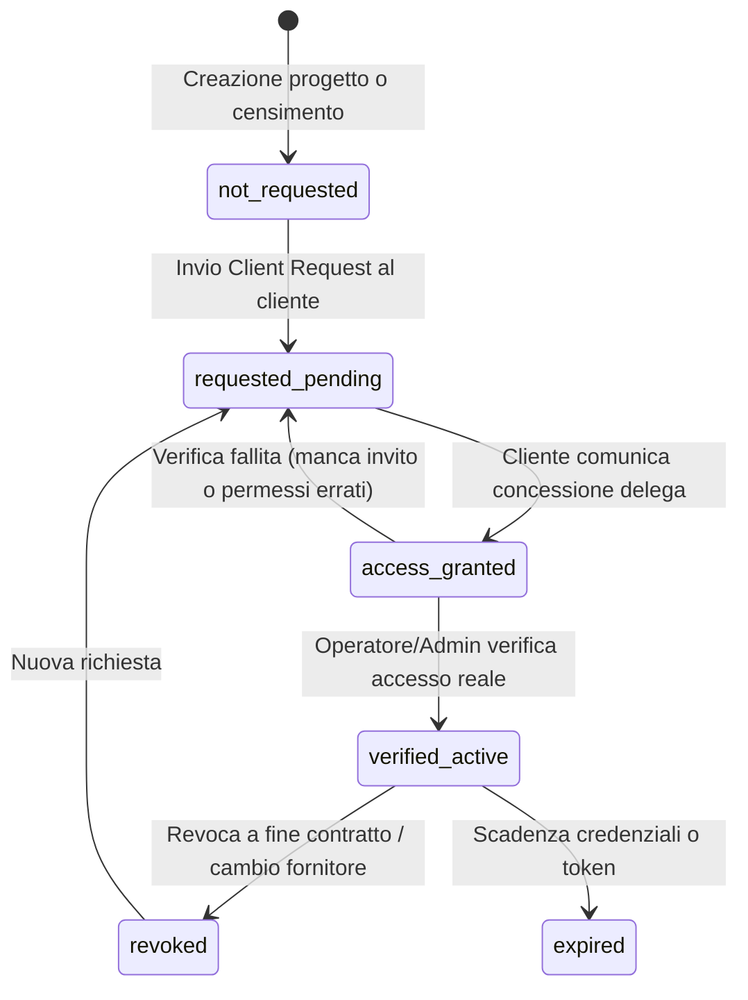
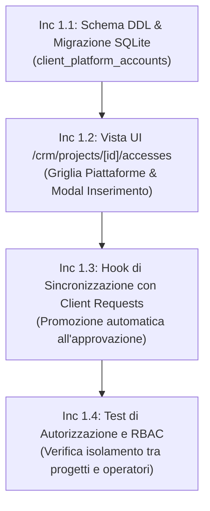
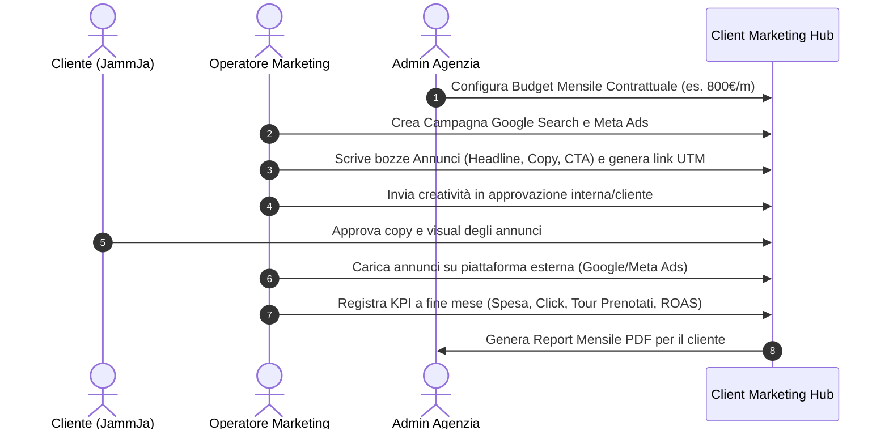
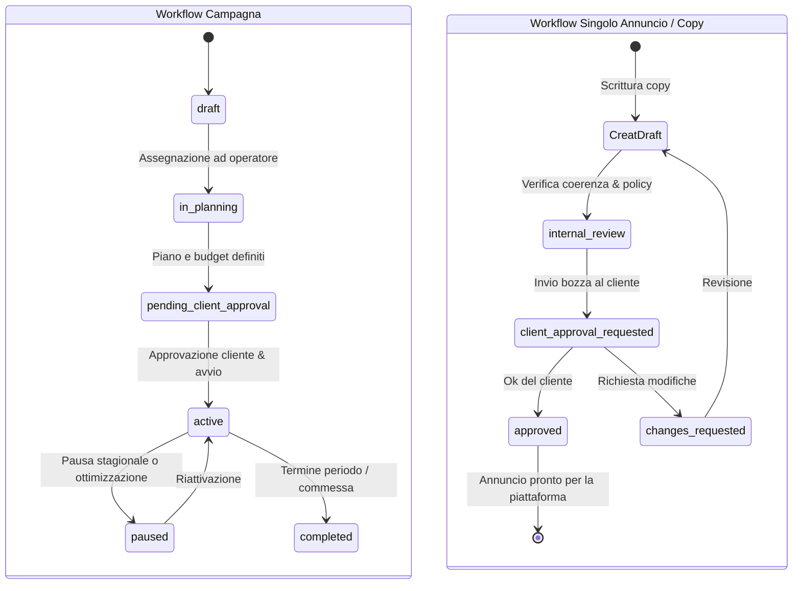
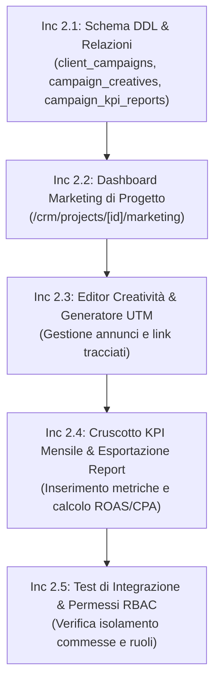
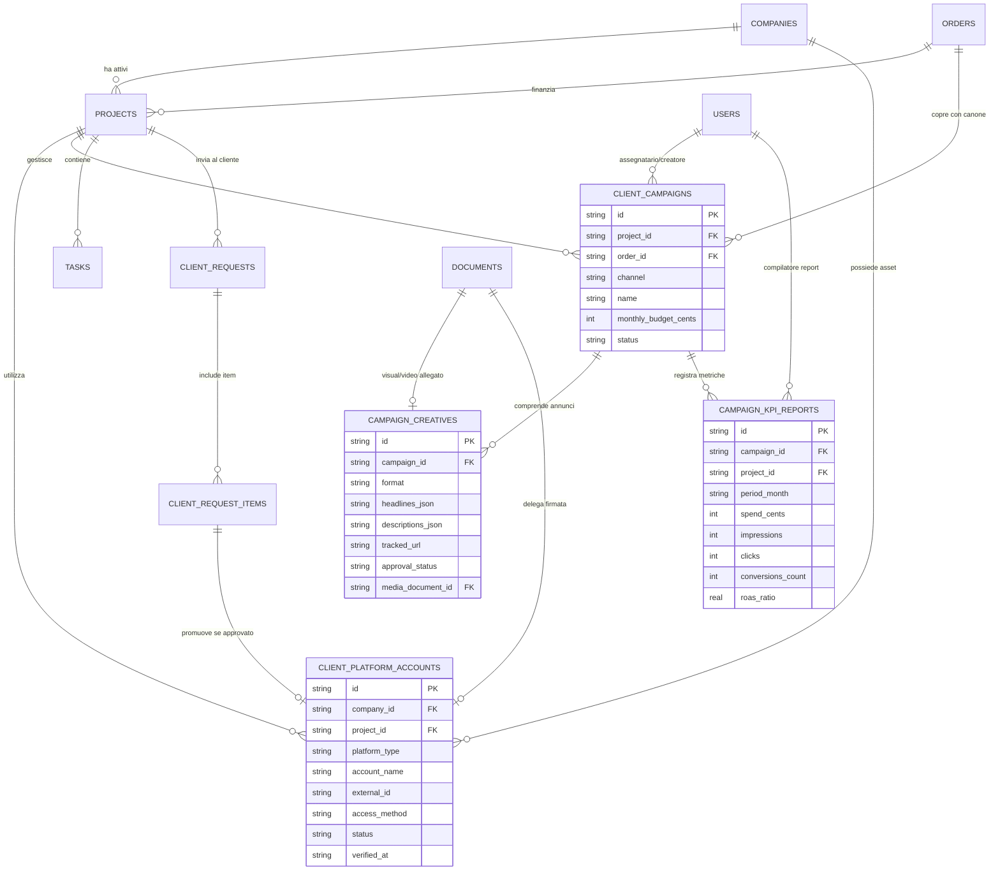

# PROGETTAZIONE ARCHITETTURALE: REGISTRO DELEGHE DIGITALI & CLIENT MARKETING HUB
## Sistema: AI Consulting CRM (`ai-consulting-crm-v1`)

> **Stato**: Proposta di Progettazione Architetturale (Zero Implementazione, Zero Deploy)  
> **Contesto di Riferimento**: Report di Collaudo [audit_jammja_locale.md](file:///C:/Users/windows11/.gemini/antigravity/scratch/ai-consulting-crm-v1/audit_jammja_locale.md)  
> **Data Progettazione**: 27 Settembre 2026  
> **Autore**: DeepMind Agentic Software Engineering Team  

---

> [!IMPORTANT]
> **PREMESSA DI SICUREZZA & STATO DEI DATI**:
> - Questo documento costituisce uno **studio di fattibilità e progettazione architetturale pura**: non vengono creati record reali, non vengono collegati account esterni e non viene effettuato alcun deploy.
> - I riferimenti a `PREV-2026-0001`, `COM-2026-0001`, al canone mensile di `800,00 €/mese` e al computo di `236 ore` lavorative sono **dati di simulazione tecnica** generati nel collaudo locale. Prima di qualunque utilizzo operativo, essi dovranno essere formalmente validati e sottoscritti a livello contrattuale con l'azienda cliente.
> - Viene mantenuta una **rigida separazione concettuale**:
>   1. **Lead Gen Territoriale Agenzia (Outbound)**: Modulo già esistente per la prospezione interna dell'agenzia (OSM, Google Places, qualificazione lead).
>   2. **Client Marketing & Ads Hub (Inbound/Performance)**: Nuovo modulo dedicato esclusivamente alla pianificazione, approvazione e rendicontazione delle campagne sponsorizzate dei clienti.

---

## INDICE GENERALE
1. [Quadro di Integrazione nel CRM Esistente](#1-quadro-di-integrazione-nel-crm-esistente)
2. [MODULO 1: Registro Account e Deleghe Digitali per Progetto/Cliente](#2-modulo-1-registro-account-e-deleghe-digitali-per-progettocliente)
   - 2.1 [Obiettivo e Perimetro Funzionale](#21-obiettivo-e-perimetro-funzionale)
   - 2.2 [Flusso Utente e Schermate Minime](#22-flusso-utente-e-schermate-minime)
   - 2.3 [Modello Dati e Tabelle Drizzle (Relazioni con Companies, Projects, Documents)](#23-modello-dati-e-tabelle-drizzle)
   - 2.4 [Ciclo di Vita, Stati e Approvazioni](#24-ciclo-di-vita-stati-e-approvazioni)
   - 2.5 [Matrice Permessi: Admin vs Operatore](#25-matrice-permessi-admin-vs-operatore)
   - 2.6 [Dati Disponibili vs Dati da Confermare (Caso JammJa)](#26-dati-disponibili-vs-dati-da-confermare-caso-jammja)
   - 2.7 [Confini di Sicurezza: Manuale vs Lettura API vs Azioni Modificanti](#27-confini-di-sicurezza)
   - 2.8 [Piano MVP in Incrementi Testabili](#28-piano-mvp-in-incrementi-testabili)
3. [MODULO 2: Client Marketing & Ads Hub (Campagne Pubblicitarie Clienti)](#3-modulo-2-client-marketing--ads-hub)
   - 3.1 [Obiettivo e Separazione da Lead Gen Agenzia](#31-obiettivo-e-separazione-da-lead-gen-agenzia)
   - 3.2 [Flusso Utente e Schermate Minime](#32-flusso-utente-e-schermate-minime)
   - 3.3 [Modello Dati e Tabelle Drizzle (Relazioni con Projects, Orders, Tasks, Documents)](#33-modello-dati-e-tabelle-drizzle)
   - 3.4 [Ciclo di Vita Campagne e Workflow Approvazione Creatività](#34-ciclo-di-vita-campagne-e-workflow-approvazione-creatività)
   - 3.5 [Matrice Permessi: Admin vs Operatore](#35-matrice-permessi-admin-vs-operatore)
   - 3.6 [Dati di Simulazione vs Dati Contrattuali da Validare](#36-dati-di-simulazione-vs-dati-contrattuali-da-validare)
   - 3.7 [Confini di Sicurezza per Azioni su Piattaforme Esterne](#37-confini-di-sicurezza-per-azioni-su-piattaforme-esterne)
   - 3.8 [Piano MVP in Incrementi Testabili](#38-piano-mvp-in-incrementi-testabili)
4. [Diagramma di Architettura Globale e Relazioni](#4-diagramma-di-architettura-globale-e-relazioni)

---

## 1. QUADRO DI INTEGRAZIONE NEL CRM ESISTENTE

I due moduli si innestano organicamente sull'infrastruttura già collaudata:
- **Core Database**: SQLite (`packages/db/src/schema.ts`) gestito con Drizzle ORM.
- **Frontend / API**: Next.js 15 App Router (`apps/web/src/app/crm/...`).
- **Autenticazione**: Sessioni JWT basate su cookie `ai_crm_session` con RBAC su ruoli globali (`admin`, `operator`) e ruoli progetto (`manager`, `editor`, `contributor`, `viewer`).
- **Documenti**: StorageProvider locale/cloud (`documents` table) per l'archiviazione di creatività, visual, contratti e deleghe.
- **Onboarding Cliente**: Il modulo `client_requests` funge da canale di ingresso per le credenziali; una volta approvati, gli accessi vengono promossi a tempo indeterminato nel *Registro Deleghe*.



---

## 2. MODULO 1: REGISTRO ACCOUNT E DELEGHE DIGITALI

### 2.1 Obiettivo e Perimetro Funzionale
Il **Registro Account e Deleghe Digitali** (*Client Digital Assets & Access Vault*) risolve il disordine operativo nella gestione delle proprietà web e pubblicitarie dei clienti:
1. **Conservazione No-Password**: Favorisce l'uso di deleghe di livello agenzia (MCC Google Ads, Partner Meta Business Manager, Utenti Delegati Google Search Console/GA4) invece di salvare credenziali in chiaro.
2. **Accesso Rapido a ID Tecnici**: Offre all'operatore un unico cruscotto dove copiare istantaneamente codici di tracciamento (es. `G-XXXXXXXXXX`, `AW-XXXXXXXXXX`, `Pixel ID: 123456789`).
3. **Ponte con le Client Requests**: Gli accessi richiesti al cliente tramite `client_requests` (categoria `accesses`) vengono automaticamente promossi nel registro permanente una volta approvati.

---

### 2.2 Flusso Utente e Schermate Minime



#### Schermate Minime:
1. **Schermata Principale Vault** (`/crm/projects/[id]/accesses` e `/crm/companies/[id]/vault`):
   - Griglia suddivisa per cluster:
     * *Infrastruttura & Web*: DNS Registrar, Hosting/Server, CMS (WordPress).
     * *Analytics & Tracciamento*: Google Analytics 4, Google Search Console, Google Tag Manager.
     * *Piattaforme Pubblicitarie*: Google Ads (CID), Meta Business Manager (Partner ID), Meta Pixel (Dataset ID).
     * *Canali Commerciali / Verticali*: Google Business Profile, Booking Engine (GetYourGuide, Click&Boat).
   - Badge di stato visuale: `Da Richiedere`, `In Attesa di Delega`, `Convalidato Attivo`, `Revocato / Scaduto`.
   - Pulsante *"Copia ID"* rapido per ciascun identificatore.
2. **Modal Censimento / Modifica Delega** (`/crm/projects/[id]/accesses/new`):
   - Tipo Piattaforma (select con icone ufficiali).
   - Nome Identificativo (es. *"Google Ads JammJa - Search & PMax"*).
   - Identificativo Esterno (es. CID a 10 cifre `123-456-7890`).
   - Metodo di Accesso (Delega Partner agenzia, Email delegata, Service Account).
   - Indirizzo Email Delegato / ID Partner Agenzia.
   - Livello Permessi (Amministratore, Standard, Sola Lettura, Solo Analisi).
   - Documento di supporto (link a PDF guida o screenshot di delega).
   - Note operative e cronologia modifiche.
3. **Drawer Dettaglio & Audit Trail**:
   - Visualizzazione dell'operatore che ha effettuato l'ultima verifica con timestamp.
   - Note e vincoli specifici (es. *"Attenzione: accesso DNS tramite OTP sul telefono del titolare"*).

---

### 2.3 Modello Dati e Tabelle Drizzle

```typescript
// packages/db/src/schema.ts

export const clientPlatformAccounts = sqliteTable('client_platform_accounts', {
  id: text('id').primaryKey(), // es. "acc_1790496100_abc"
  companyId: text('company_id')
    .notNull()
    .references(() => companies.id),
  projectId: text('project_id')
    .references(() => projects.id), // Opzionale: account globale azienda o specifico progetto
  
  platformType: text('platform_type', {
    enum: [
      'dns_registrar',
      'hosting_server',
      'cms_wordpress',
      'google_analytics_4',
      'google_search_console',
      'google_tag_manager',
      'google_ads_account',
      'google_business_profile',
      'meta_business_manager',
      'meta_pixel_dataset',
      'meta_facebook_page',
      'meta_instagram_business',
      'booking_engine_tour',
      'other_custom'
    ]
  }).notNull(),

  accountName: text('account_name').notNull(), // es. "Google Ads JammJa"
  externalId: text('external_id'),             // es. CID "456-789-0123", GA4 "G-987XYZ"
  externalUrl: text('external_url'),           // Link diretto al pannello esterno
  
  accessMethod: text('access_method', {
    enum: [
      'agency_mcc_partner',      // Tramite MCC / Business Manager Agenzia
      'delegated_agency_email',  // Invito email a operatore/agenzia
      'service_account_api',     // Token API / Service Account
      'credential_vault_entry',  // Password gestita in cassaforte esterna
      'manual_verification_only' // Nessun accesso diretto, verifica visuale
    ]
  }).notNull().default('agency_mcc_partner'),

  accessLevel: text('access_level', {
    enum: ['admin', 'standard_edit', 'read_only_analytics', 'finance_only']
  }).notNull().default('standard_edit'),

  delegatedToIdentifier: text('delegated_to_identifier'), // es. "mcc@ai-agency.it"
  
  status: text('status', {
    enum: [
      'not_requested',     // Non ancora richiesto
      'requested_pending', // In attesa che il cliente accetti l'invito/conceda delega
      'access_granted',    // Cliente dichiara di aver concesso l'accesso
      'verified_active',   // Operatore ha verificato l'effettivo accesso
      'revoked',           // Delega revocata o interrotta
      'expired'            // Credenziali o invito scaduti
    ]
  }).notNull().default('not_requested'),

  originClientRequestId: text('origin_client_request_id')
    .references(() => clientRequests.id),
  originClientRequestItemId: text('origin_client_request_item_id')
    .references(() => clientRequestItems.id),
  
  evidenceDocumentId: text('evidence_document_id')
    .references(() => documents.id), // Screenshot o documento di conferma

  notes: text('notes'),
  
  verifiedByUserId: text('verified_by_user_id')
    .references(() => users.id),
  verifiedAt: text('verified_at'),
  
  createdAt: text('created_at').notNull(),
  updatedAt: text('updated_at').notNull(),
}, (table) => ({
  companyIdx: index('client_plat_acc_company_idx').on(table.companyId),
  projectIdx: index('client_plat_acc_project_idx').on(table.projectId),
  platformTypeIdx: index('client_plat_acc_type_idx').on(table.platformType),
  statusIdx: index('client_plat_acc_status_idx').on(table.status),
}));
```

---

### 2.4 Ciclo di Vita, Stati e Approvazioni



- **Regola di Approvazione**: Solo un utente con ruolo `admin` o `editor` assegnato al progetto può promuovere lo stato da `access_granted` a `verified_active`. La promozione richiede la registrazione di `verified_by_user_id` e `verified_at`.

---

### 2.5 Matrice Permessi: Admin vs Operatore

| Azione nel Registro Account | Ruolo Amministratore (Admin) | Ruolo Operatore (Assegnato al Progetto) | Ruolo Operatore (Non Assegnato) |
| :--- | :---: | :---: | :---: |
| **Visualizzazione Elenco & ID Tecnici** | Consentito (Globale) | Consentito (Progetti Assegnati) | Negato (403) |
| **Inserimento Nuovo Account / Delega** | Consentito | Consentito | Negato (403) |
| **Modifica Note e Metadati** | Consentito | Consentito | Negato (403) |
| **Validazione Stato (`verified_active`)** | Consentito | Consentito | Negato (403) |
| **Cancellazione Definitiva Record** | Consentito | Negato (Richiede Admin) | Negato (403) |
| **Configurazione ID Master Agenzia (MCC)** | Consentito (`/crm/settings`) | Negato (403) | Negato (403) |

---

### 2.6 Dati Disponibili vs Dati da Confermare (Caso JammJa)

| Proprietà / Piattaforma | Stato Attuale nel Collaudo | Dati Verificati Disponibili | Dati da Confermare con JammJa |
| :--- | :---: | :--- | :--- |
| **Dominio & DNS (`jamm-ja.it`)** | `requested` | Dominio attivo verificato su web (27/09/2026). | Registrar effettivo (es. Aruba, Register.it) e gestione record DNS. |
| **Hosting & Web Server** | `requested` | Sito web raggiungibile con certificato SSL. | Provider server, credenziali FTP/cPanel o SSH per deploy. |
| **Google Analytics 4** | `requested` | — | Esistenza di una proprietà GA4 attiva o necessità di creazione ex-novo con Measurement ID. |
| **Google Search Console** | `requested` | — | Delega su proprietà a livello di dominio. |
| **Google Ads (Account)** | `requested` | — | CID a 10 cifre per collegamento sotto MCC agenzia, oppure creazione nuovo account. |
| **Meta Business Manager** | `requested` | Pagina FB/Instagram con brand JammJa. | ID Business Manager del titolare per invito Partner e condivisione Pixel. |
| **Motore Booking / Escursioni** | `requested` | Servizio tour barche attivo. | Piattaforma di prenotazione online utilizzata (es. FareHarbor, GetYourGuide, WhatsApp). |

---

### 2.7 Confini di Sicurezza: Manuale vs Lettura API vs Azioni Modificanti

> [!CAUTION]
> **POLITICA DI SICUREZZA PER LE DELEGHE DIGITALI**:
> 1. **Inserimento Manuale (Incluso in MVP)**: L'operatore inserisce gli identificativi tecnici. Nessun token o chiave API viene esposta o salvata in chiaro.
> 2. **Lettura API Passiva (Fase Successiva)**: Possibilità di effettuare ping di sola lettura per verificare lo stato di un Pixel o la ricezione di dati GA4.
> 3. **Azioni Modificanti su Account Esterni (ESCLUSE / PROIBITE)**: Il CRM non effettuerà mai operazioni automatiche di concessione o revoca permessi su Google Workspace, Meta o Server senza preventiva conferma esplicita a due fattori dell'amministratore.

---

### 2.8 Piano MVP in Incrementi Testabili



1. **Incremento 1.1**: Creazione tabella `client_platform_accounts` con indici su SQLite e migrazione retrocompatibile.
2. **Incremento 1.2**: Implementazione vista grafica con card per piattaforma e badge di stato colorati.
3. **Incremento 1.3**: Collegamento con il completamento degli item delle `client_requests`.
4. **Incremento 1.4**: Suite di test automatici (verifica che l'operatore non assegnato riceva 403 Forbidden).

---

## 3. MODULO 2: CLIENT MARKETING & ADS HUB

### 3.1 Obiettivo e Separazione da Lead Gen Agenzia

Il CRM include già un modulo di *"Lead Gen Territoriale"* che interroga OpenStreetMap e Google Places per trovare potenziali clienti per l'agenzia.  
Il nuovo modulo **Client Marketing & Ads Hub** opera invece sul versante opposto: **la gestione dei servizi di marketing a performance per conto dei clienti acquisiti**.

```mermaid
flowchart LR
    subgraph Lead Gen Agenzia (OUTBOUND - Gia Esistente)
        OSM["Scraping OSM / Maps"] --> QUAL["Score Lead & Arricchimento"]
        QUAL --> PROSP["Prospezione & Invio Offerta Agenzia"]
    end

    subgraph Client Marketing Hub (INBOUND PERFORMANCE - Nuovo Modulo)
        PLAN["Pianificazione Budget & Canali Cliente"] --> COPY["Bozze Copy & Visual Annunci"]
        COPY --> APPR["Approvazione Cliente/Manager"]
        APPR --> UTM["Generazione Link Tracciati UTM"]
        UTM --> KPI_TRACK["Raccolta & Reportistica KPI Mensile"]
    end
```

---

### 3.2 Flusso Utente e Schermate Minime



#### Schermate Minime:
1. **Dashboard Marketing di Progetto** (`/crm/projects/[id]/marketing`):
   - Box Budget Mensile: Budget totale contrattualizzato vs allocato per canale.
   - Lista Campagne Attive con canale, budget allocato, date di erogazione e stato.
   - Cruscotto KPI del mese corrente (Spesa totale, Clic totali, Conversioni/Lead, ROAS stimato).
2. **Dettaglio Campagna & Creatività** (`/crm/projects/[id]/marketing/campaigns/[campaignId]`):
   - Scheda Obiettivo & Target (Geografico, Lingua, Pubblico).
   - Lista Annunci / Varianti Copy con visualizzatore anteprima (Mockup Google Search / Mockup Meta Card).
   - Stato approvazione di ciascun annuncio con pulsante di richiesta revisione e storico commenti.
3. **Generatore Parametri UTM Integrato**:
   - URL Pulito -> Selezione Canale (`google`, `facebook`, `instagram`, `newsletter`).
   - Generazione automatica di `utm_source`, `utm_medium`, `utm_campaign`, `utm_content`.
   - Pulsante *"Copia Link Finale"* con validazione sintassi.
4. **Scheda Report Mensile & Inserimento KPI** (`/crm/projects/[id]/marketing/reports`):
   - Form inserimento dati a chiusura mese: Spesa effettiva (da fattura Google/Meta), Impression, Clic, Conversioni (prenotazioni/lead), Valore conversioni stimato.
   - Calcolo automatico di CTR %, CPC medio, CPA e ROAS.
   - Campo *"Note di Analisi & Strategia Mese Successivo"*.
   - Pulsante *"Esporta Report per Cliente (PDF / Stampa)"*.

---

### 3.3 Modello Dati e Tabelle Drizzle

```typescript
// packages/db/src/schema.ts

export const clientCampaigns = sqliteTable('client_campaigns', {
  id: text('id').primaryKey(), // es. "cmp_1790496100_xyz"
  projectId: text('project_id')
    .notNull()
    .references(() => projects.id),
  orderId: text('order_id')
    .references(() => orders.id), // Collegamento alla commessa contrattuale
  platformAccountId: text('platform_account_id')
    .references(() => clientPlatformAccounts.id), // Collegamento all'account delegato
  
  name: text('name').notNull(), // es. "Google Search - Tour Privati Capri & Costiera"
  
  channel: text('channel', {
    enum: [
      'google_search',
      'google_performance_max',
      'google_display_remarketing',
      'meta_ads_lead_generation',
      'meta_ads_conversions',
      'meta_ads_brand_awareness',
      'local_seo_google_maps',
      'email_marketing_retention',
      'other_channel'
    ]
  }).notNull(),

  objective: text('objective').notNull(), // es. "Acquisizione prenotazioni tour barca privati"
  
  monthlyBudgetCents: integer('monthly_budget_cents').notNull().default(0), // es. 80000 = 800,00 €
  currency: text('currency').notNull().default('EUR'),
  
  startDate: text('start_date'),
  endDate: text('end_date'), // Nullable per campagne continuative mensili
  
  status: text('status', {
    enum: [
      'draft',                 // In fase di ideazione
      'in_planning',           // Definizione keyword e copy
      'pending_client_approval',// In attesa di ok del cliente
      'active',                // Campagna attiva in erogazione
      'paused',                // In pausa (es. fine stagione turistica)
      'completed',             // Conclusa
      'cancelled'              // Annullata
    ]
  }).notNull().default('draft'),

  targetGeography: text('target_geography'), // es. "Costiera Amalfitana, Napoli, Turisti US/UK"
  targetLanguages: text('target_languages'), // es. "it, en, de"
  targetKeywordsJson: text('target_keywords_json'), // Array di parole chiave primarie
  
  assignedOperatorId: text('assigned_operator_id')
    .references(() => users.id),
  createdBy: text('created_by')
    .notNull()
    .references(() => users.id),
  
  createdAt: text('created_at').notNull(),
  updatedAt: text('updated_at').notNull(),
}, (table) => ({
  projectIdx: index('client_camp_project_idx').on(table.projectId),
  channelIdx: index('client_camp_channel_idx').on(table.channel),
  statusIdx: index('client_camp_status_idx').on(table.status),
}));

export const campaignCreatives = sqliteTable('campaign_creatives', {
  id: text('id').primaryKey(),
  campaignId: text('campaign_id')
    .notNull()
    .references(() => clientCampaigns.id),
  
  variantName: text('variant_name').notNull(), // es. "Annuncio Adattabile 1 - Focus Capri Luxury"
  
  format: text('format', {
    enum: [
      'search_responsive_ad',
      'meta_single_image',
      'meta_carousel',
      'meta_video_reel',
      'display_responsive_banner'
    ]
  }).notNull().default('search_responsive_ad'),

  // JSON content per flessibilità formati Google / Meta
  headlinesJson: text('headlines_json').notNull().default('[]'), // Array stringhe titoli
  descriptionsJson: text('descriptions_json').notNull().default('[]'), // Array descrizioni
  primaryBodyCopy: text('primary_body_copy'), // Copy lungo per post Meta
  callToAction: text('call_to_action').default('Richiedi Disponibilità'),
  
  destinationUrl: text('destination_url').notNull(), // Pagina di atterraggio pulita
  trackedUrl: text('tracked_url'),                   // URL generato con parametri UTM
  
  mediaDocumentId: text('media_document_id')
    .references(() => documents.id), // Visual / Video memorizzato nello Storage Vault

  approvalStatus: text('approval_status', {
    enum: [
      'draft',
      'internal_review',
      'client_approval_requested',
      'approved',
      'changes_requested'
    ]
  }).notNull().default('draft'),

  feedbackNotes: text('feedback_notes'),
  
  approvedByUserId: text('approved_by_user_id')
    .references(() => users.id),
  approvedAt: text('approved_at'),
  
  createdAt: text('created_at').notNull(),
  updatedAt: text('updated_at').notNull(),
}, (table) => ({
  campaignIdx: index('camp_creat_campaign_idx').on(table.campaignId),
  approvalIdx: index('camp_creat_approval_idx').on(table.approvalStatus),
}));

export const campaignKpiReports = sqliteTable('campaign_kpi_reports', {
  id: text('id').primaryKey(),
  campaignId: text('campaign_id')
    .notNull()
    .references(() => clientCampaigns.id),
  projectId: text('project_id')
    .notNull()
    .references(() => projects.id),
  
  periodMonth: text('period_month').notNull(), // Formato "YYYY-MM", es. "2026-10"
  
  spendCents: integer('spend_cents').notNull().default(0), // Spesa effettiva canali
  impressions: integer('impressions').notNull().default(0),
  clicks: integer('clicks').notNull().default(0),
  conversionsCount: integer('conversions_count').notNull().default(0), // Lead o Prenotazioni
  conversionValueCents: integer('conversion_value_cents').default(0),   // Fatturato generato stimato
  
  // Metriche derivate memorizzate per storicizzazione
  cpcAverageEuro: real('cpc_average_euro'),
  ctrPercentage: real('ctr_percentage'),
  cpaEuro: real('cpa_euro'),
  roasRatio: real('roas_ratio'),
  
  sourceType: text('source_type', {
    enum: ['manual_entry', 'csv_import', 'readonly_api_sync']
  }).notNull().default('manual_entry'),

  executiveSummary: text('executive_summary'), // Sintesi discorsiva operatore
  optimizationsPlanned: text('optimizations_planned'), // Azioni correttive mese successivo
  
  recordedByUserId: text('recorded_by_user_id')
    .notNull()
    .references(() => users.id),
  
  createdAt: text('created_at').notNull(),
  updatedAt: text('updated_at').notNull(),
}, (table) => ({
  campaignPeriodIdx: index('camp_kpi_camp_period_idx').on(table.campaignId, table.periodMonth),
  projectIdx: index('camp_kpi_project_idx').on(table.projectId),
}));
```

---

### 3.4 Ciclo di Vita Campagne e Workflow Approvazione Creatività



---

### 3.5 Matrice Permessi: Admin vs Operatore

| Azione nel Marketing Hub | Ruolo Admin | Ruolo Operatore (Assegnato) | Ruolo Operatore (Non Assegnato) |
| :--- | :---: | :---: | :---: |
| **Creazione / Chiusura Campagna** | Consentito | Consentito | Negato (403) |
| **Modifica Budget Contrattuale** | Consentito | Negato (Richiede Admin) | Negato (403) |
| **Creazione & Modifica Copy / Creatività** | Consentito | Consentito | Negato (403) |
| **Approvazione Interna Annunci** | Consentito | Consentito (`editor`) | Negato (403) |
| **Inserimento Dati KPI Mensili** | Consentito | Consentito | Negato (403) |
| **Generazione Report Finale PDF** | Consentito | Consentito | Negato (403) |

---

### 3.6 Dati di Simulazione vs Dati Contrattuali da Validare

```text
+---------------------------------------------------------------------------------------------------+
|  TABELLA DI SEGREGAZIONE DEI DATI: SIMULAZIONE COLLAUDO vs VALIDAZIONE REALE                      |
+---------------------------------------------------------------------------------------------------+
|  Elemento               | Valore nel Collaudo Locale      | Condizione di Validazione Contrattuale|
+-------------------------+---------------------------------+---------------------------------------+
|  Preventivo Riferimento | PREV-2026-0001 (6.710,00 €)     | Firma formale del cliente JammJa      |
|  Commessa Operativa     | COM-2026-0001 (Stato: Da Avviare)| Accettazione offerta e acconto avvio  |
|  Canone Mensile Ads     | 800,00 €/mese (Voce ricorrente) | Definizione budget media + fee agenzia|
|  Monte Ore Stimato Sito | 236 ore lavorative (21 task)    | Verifica disponibilità team operativo |
|  Stagionalità Tour      | Maggio - Ottobre (Simulata)     | Calendario effettivo aperture charter |
+---------------------------------------------------------------------------------------------------+
```

---

### 3.7 Confini di Sicurezza per Azioni su Piattaforme Esterne

```mermaid
graph TD
    subgraph Livello A: CRM Standalone (MVP Sicuro)
        A1["Pianificazione Budget"] --> A2["Copywriting & Approvazione"]
        A2 --> A3["Generazione Link UTM"]
        A3 --> A4["Inserimento Manuale / CSV KPI a fine mese"]
    end

    subgraph Livello B: Sola Lettura API (Fase 2)
        B1["Google Ads API (Read-Only)"] -. "Download Spesa & Clic" .-> A4
        B2["Meta Marketing API (Read-Only)"] -. "Download Impression & CTR" .-> A4
    end

    subgraph Livello C: Write su Account Esterni (BLOCCATO)
        C1["Creazione automatica campagne reali"] --> STOP["❌ DISABILITATO / NON CONSENTITO"]
        C2["Modifica budget su carte di credito cliente"] --> STOP
    end
```

- **Garanzia di Sicurezza**: Nel nostro design, il CRM non effettua addebiti né modifiche dirette sui canali pubblicitari esterni. L'operatore carica le creatività e imposta il budget direttamente nei pannelli ufficiali di Google Ads e Meta Ads, utilizzando i parametri UTM generati dal CRM per garantire una perfetta tracciabilità.

---

### 3.8 Piano MVP in Incrementi Testabili



1. **Incremento 2.1**: DDL Drizzle per le 3 tabelle del Marketing Hub con indici e relazioni referenziali con `projects`, `orders` e `documents`.
2. **Incremento 2.2**: Schermata `/crm/projects/[id]/marketing` con statistiche budget e selettore canali.
3. **Incremento 2.3**: Componente editor per annunci adattabili Google e post Meta con generatore di URL tracciati con parametri UTM.
4. **Incremento 2.4**: Form di caricamento metriche mensili con calcolo matematico automatico di CTR, CPC, CPA e ROAS ed esportazione report in Markdown/PDF.
5. **Incremento 2.5**: Test di regressione automatizzati per verificare che gli operatori non assegnati ricevano 403 Forbidden.

---

## 4. DIAGRAMMA DI ARCHITETTURA GLOBALE E RELAZIONI



---
*Fine del Documento di Progettazione Architetturale.*
